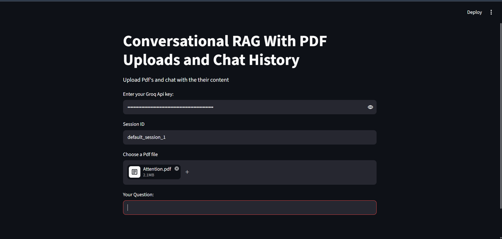
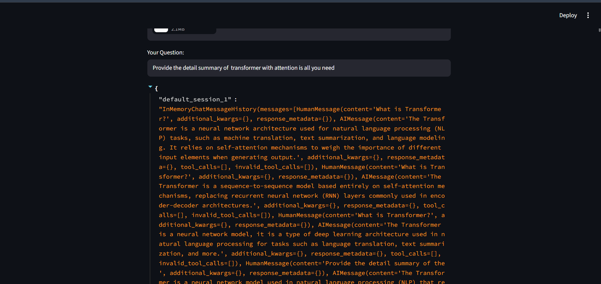
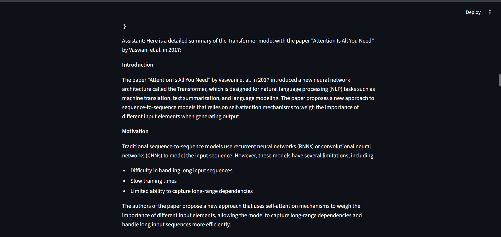
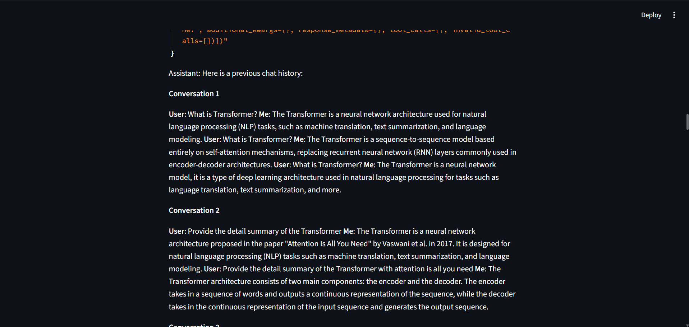

# 📄 Conversational RAG with PDF Uploads & Chat History

A **Conversational Retrieval-Augmented Generation (RAG)** application built with **LangChain**, **Groq**, **ChromaDB**, **Hugging Face Embeddings**, and **Streamlit**.

Upload a PDF document, ask questions about its content, and continue the conversation naturally with **session-based chat history**.

---

## 🚀 Features

- 📄 Upload and process PDF documents
- 💬 Ask questions about uploaded PDFs
- 🧠 Context-aware conversations using chat history
- 🔍 Semantic search with Chroma Vector Database
- 🤖 Fast responses powered by Groq (Llama 3.1)
- 📚 Hugging Face Sentence Transformers embeddings
- 📝 Multiple conversations using Session IDs
- ⚡ Simple and interactive Streamlit interface

---

# 🖼️ Project Preview

## 🏠 Home Page



---

## 💬 Question Answering

The chatbot retrieves the most relevant information from the uploaded PDF and generates accurate answers.

### Example 1



### Example 2



---

## 🧠 Chat History

The chatbot remembers previous conversations within the same session, allowing follow-up questions without losing context.



---

# 🏗️ Tech Stack

| Technology | Purpose |
|------------|---------|
| Python | Programming Language |
| Streamlit | User Interface |
| LangChain | LLM Framework |
| Groq | LLM Inference |
| ChromaDB | Vector Database |
| Hugging Face | Text Embeddings |
| PyPDFLoader | PDF Processing |
| RecursiveCharacterTextSplitter | Document Chunking |
| RunnableWithMessageHistory | Chat Memory |
| dotenv | Environment Variables |

---

# 📂 Project Structure

```text
rag-with-pdf-upload/
│
├── photos/
│   ├── home_page.png
│   ├── question-answer1.png
│   ├── question-answer2.png
│   └── chat-history.png
│
├── app.py
├── requirements.txt
├── README.md
├── .gitignore
├── .env
└── temp.pdf
```

---

# ⚙️ Installation

## 1. Clone the Repository

```bash
git clone https://github.com/amnsingh05/rag-with-pdf-upload.git
```

```bash
cd rag-with-pdf-upload
```

---

## 2. Create a Virtual Environment

### Windows

```bash
python -m venv venv
```

Activate the environment

```bash
venv\Scripts\activate
```

---

## 3. Install Dependencies

```bash
pip install -r requirements.txt
```

---

## 4. Configure Environment Variables

Create a `.env` file in the project directory.

```env
HF_TOKEN=your_huggingface_token
```

> **Note:** The Groq API Key is entered directly in the Streamlit application.

---

## 5. Run the Application

```bash
streamlit run app.py
```

---

# 🔄 Application Workflow

```text
                Upload PDF
                     │
                     ▼
              PyPDFLoader
                     │
                     ▼
       RecursiveCharacterTextSplitter
                     │
                     ▼
     Hugging Face Sentence Embeddings
                     │
                     ▼
          Chroma Vector Database
                     │
                     ▼
      History Aware Retriever
                     │
                     ▼
       Groq (Llama 3.1 Instant)
                     │
                     ▼
        Generate Context-Aware Answer
                     │
                     ▼
      Store Conversation History
```

---

# 💬 Example Questions

- What is the Transformer architecture?
- Summarize the uploaded paper.
- Explain self-attention in simple terms.
- What problem does the paper solve?
- What are the encoder and decoder?
- What are the key contributions of the paper?
- Explain positional encoding.
- Provide a detailed summary.

---

# ✨ Concepts Demonstrated

- Retrieval-Augmented Generation (RAG)
- Conversational RAG
- Context-Aware Retrieval
- Chat History Management
- Vector Embeddings
- Semantic Search
- Prompt Engineering
- Document Chunking
- Session-Based Conversations

---

# 📦 Dependencies

- Streamlit
- LangChain
- LangChain Community
- LangChain Classic
- LangChain Chroma
- LangChain Groq
- LangChain HuggingFace
- ChromaDB
- Sentence Transformers
- PyPDF
- Python Dotenv

---

# 🚀 Future Improvements

- 📚 Multiple PDF uploads
- 💬 ChatGPT-style chat interface
- 📖 Source citations
- ⚡ Streaming responses
- 💾 Persistent Chroma database
- ☁️ Streamlit Cloud deployment
- 📥 Export chat history
- 🎨 Improved UI/UX
- 🌐 Multi-document retrieval

---

# 👨‍💻 Author

### Aman Singh

**LinkedIn**

https://linkedin.com/in/amnsingh0

**GitHub**

https://github.com/amnsingh05

---

## ⭐ If you found this project helpful, consider giving it a Star on GitHub!

It helps others discover the project and motivates future improvements.

---